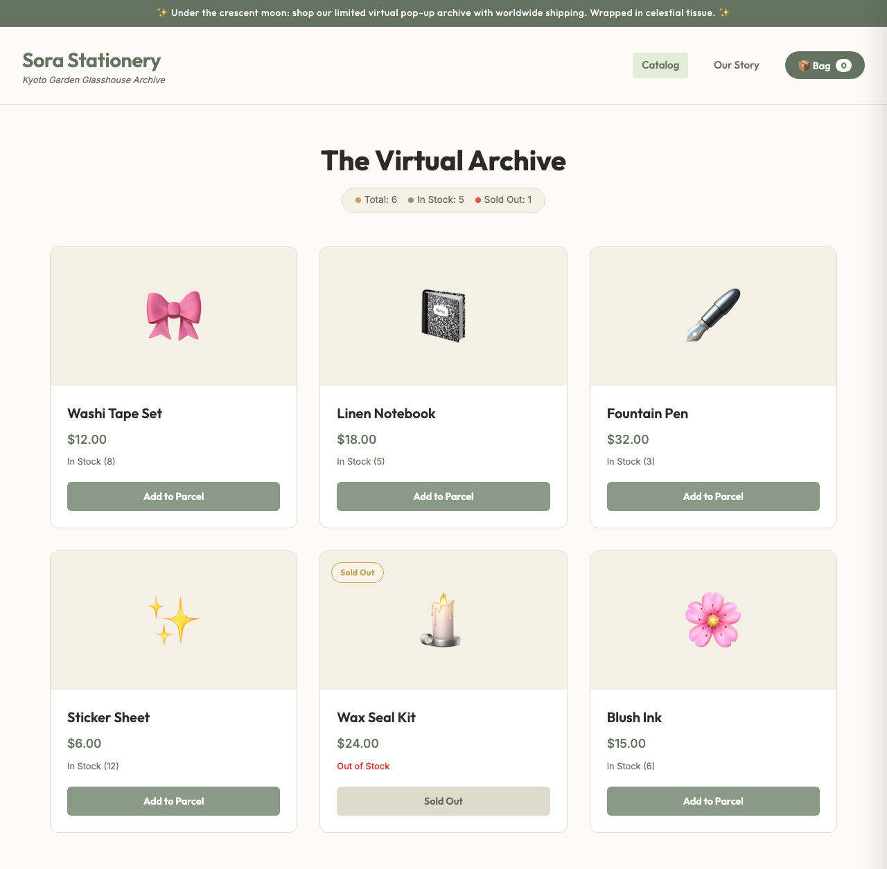

# Codelab: From AI Studio Prototype to Production with One-Click Export

A hands-on **prototype-to-production tutorial**: build a small shop from one prompt in
**AI Studio Build**, bring it into a local **Antigravity 2.0** workspace with one-click
**Export to Antigravity** (code *and* your agent conversation carry over), then drive the
in-app agent to harden the raw React/Vite export into a clean, tested, deployable static
app — against a production-readiness contract that makes "done" objective.

**▶️ Start the codelab:** https://happycode.studio/gde-sprint-26-aistudio-public/

## What you'll build

A hardened, fully static shop — a product grid with live stock states, a hash router,
and an About page — refactored by the agent from a raw AI Studio export:



## Get the contract

You build *your own* shop in AI Studio, so this kit ships the portable **contract** you
harden it against — not a throwaway app. Pull down just the `workspace/` folder with a
sparse checkout:

```bash
git clone --no-checkout --depth 1 https://github.com/evanca/gde-sprint-26-aistudio-public.git
cd gde-sprint-26-aistudio-public
git sparse-checkout init --cone
git sparse-checkout set workspace
git checkout
```

- `workspace/` — the production-readiness **contract** (`tests/shop.test.js`,
  `verify.mjs`, `package.json`). Drop `tests/` and `verify.mjs` into your exported
  project and harden until both `node --test` and `node verify.mjs` pass. It asserts the
  production *shape* (data out of markup, pure tested helpers, a hash router,
  accessibility, docs), so it holds for whatever shop you built.
- [`reference/`](./reference) — the **worked example**: a hardened *Sora Stationery*
  shop that meets the whole contract, for comparison.

The contract is plain Node.js, verified offline with `node --test` (Node.js 20+).
Building the prototype uses **AI Studio Build** (`aistudio.google.com/apps`); the export
and hardening happen in the **Antigravity 2.0** desktop app
(`antigravity.google/download`).

Follow the [codelab](https://happycode.studio/gde-sprint-26-aistudio-public/) from here.

---

Google Cloud credits were provided for this project as part of the Agentic Architect Sprint 2026.

#AgenticArchitect #GoogleAntigravity #GoogleAIStudio
